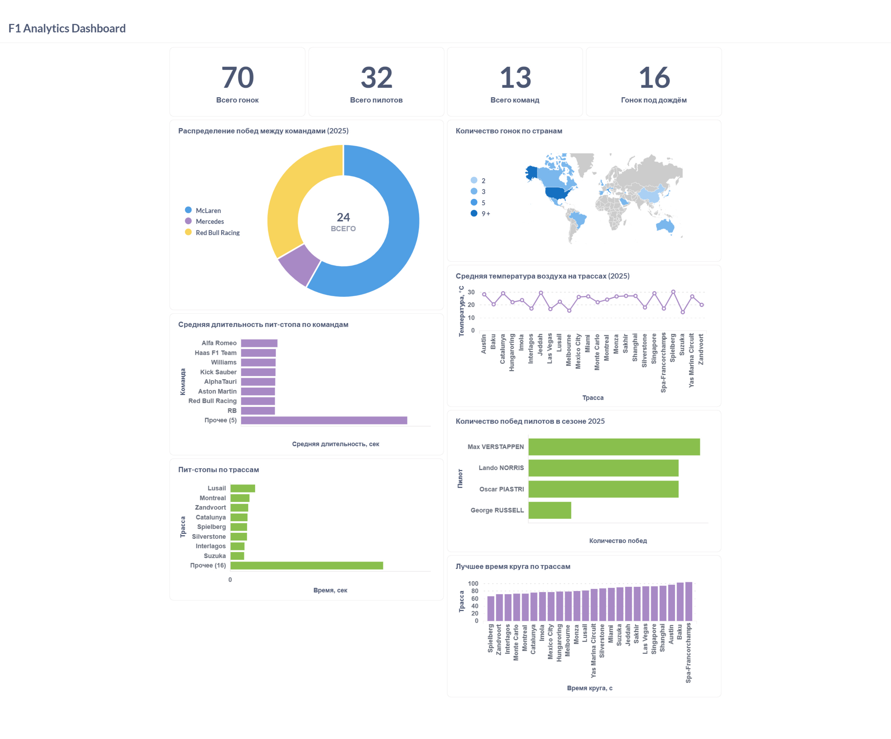

# F1 Data Pipeline

**Трек:** Data Engineering  
**Автор:** Дарья Байгина  
**Репозиторий:** https://github.com/ddaria9876543/f1-data-pipeline

## О проекте

Проект представляет собой ETL-пайплайн для автоматической загрузки, обработки и анализа данных чемпионата Formula 1.

Источником данных является открытый API [OpenF1](https://openf1.org/). Данные загружаются с помощью Apache Airflow в PostgreSQL, преобразуются в аналитические витрины с помощью dbt и визуализируются в Metabase.

В проекте используются данные сезонов **2023–2025**.

Система автоматически:

- получает данные из OpenF1 API;
- загружает сырые данные в PostgreSQL;
- обрабатывает ошибки API и повторяет неудачные запросы;
- очищает и типизирует данные;
- формирует staging-модели и аналитические витрины;
- выполняет проверки качества данных;
- предоставляет данные для BI-дашборда в Metabase.

---

## Основные показатели проекта

- 3 сезона Formula 1;
- 70 состоявшихся гонок;
- 6 исходных таблиц;
- 6 staging-моделей;
- 6 аналитических витрин;
- 2 модели контроля качества данных;
- 29 dbt-тестов.

---

## Архитектура

```text
OpenF1 API
     │
     ▼
Apache Airflow
     │
     ▼
PostgreSQL
Raw Layer
     │
     ▼
dbt
Staging + Data Marts + Data Quality
     │
     ▼
Metabase
BI Dashboard
```

Основной рабочий поток проекта:

```text
OpenF1 API → Airflow → PostgreSQL → dbt → Metabase
```

---

## Используемые технологии

| Компонент | Технология |
|---|---|
| Язык программирования | Python |
| Источник данных | OpenF1 API |
| Оркестрация ETL | Apache Airflow 2.8.2 |
| База данных | PostgreSQL |
| Трансформация данных | dbt 1.8 |
| BI-система | Metabase |
| Контейнеризация | Docker, Docker Compose |
| Контроль версий | Git, GitHub |

---

## Загружаемые данные

Airflow получает из OpenF1 API следующие сущности:

| Таблица | Содержание |
|---|---|
| `sessions` | Сессии Formula 1 |
| `drivers` | Пилоты и команды |
| `laps` | Времена кругов и секторов |
| `pit_stops` | Пит-стопы |
| `positions` | Изменения позиций пилотов |
| `weather` | Погодные измерения |

---

## ETL-пайплайн

Основной DAG:

```text
f1_data_pipeline
```

Задачи выполняются последовательно:

```text
load_sessions
      ↓
load_drivers
      ↓
load_laps
      ↓
load_pit_stops
      ↓
load_weather
      ↓
load_positions
```

Последовательный запуск позволяет не превышать ограничения OpenF1 API.

В модуле извлечения данных реализованы:

- повторные попытки при сетевых ошибках;
- обработка ошибки `429 Too Many Requests`;
- увеличенная задержка между повторными запросами;
- пауза между успешными запросами;
- обработка `404 Not Found` для сессий, по которым отсутствуют отдельные типы данных;
- завершение задачи Airflow с ошибкой, если данные не удалось получить после всех попыток.

---

## Преобразование данных в dbt

### Staging-модели

Staging-модели очищают и типизируют сырые данные:

- `stg_sessions`
- `stg_drivers`
- `stg_laps`
- `stg_pit_stops`
- `stg_positions`
- `stg_weather`

### Аналитические витрины

| Витрина | Назначение |
|---|---|
| `mart_driver_performance` | Результаты и показатели пилотов |
| `mart_team_comparison` | Сравнение команд по сезонам |
| `mart_fastest_laps` | Лучшие круги пилотов по трассам |
| `mart_pit_stop_impact` | Анализ пит-стопов и итоговых позиций |
| `mart_weather_analysis` | Погодные условия во время гонок |
| `mart_race_summary` | Сводная информация по состоявшимся гонкам |

В `mart_race_summary` исключаются отменённые гонки, по которым отсутствуют данные о результатах. Например, отменённая гонка в Имоле в 2023 году не учитывается в итоговой статистике.

---

## Контроль качества данных

В проекте используются стандартные dbt-тесты и отдельные модели для поиска аномалий.

### Модели Data Quality

- `dq_lap_anomalies` — поиск аномальных значений времени круга;
- `dq_weather_anomalies` — поиск некорректных погодных измерений.

Проверяются:

- пропуски в ключевых полях;
- уникальность идентификаторов;
- допустимые диапазоны значений;
- корректность итоговых результатов;
- наличие победителя у состоявшейся гонки.

---

## BI-дашборд

В Metabase создан аналитический дашборд Formula 1.

Основные элементы дашборда:

| Визуализация | Что показывает | Тип |
|---|---|---|
| Всего гонок | Количество состоявшихся гонок | KPI |
| Всего пилотов | Количество пилотов | KPI |
| Всего команд | Количество команд | KPI |
| Гонок под дождём | Количество дождевых гонок | KPI |
| Средняя позиция команд | Сравнение результатов команд | Горизонтальная диаграмма |
| Победы пилотов | Количество побед каждого пилота | Горизонтальная диаграмма |
| Победы команд | Распределение побед между командами | Круговая диаграмма |
| Температура воздуха | Средняя температура по трассам | Линейный график |
| Лучшие круги | Минимальное время круга по трассам | Горизонтальная диаграмма |
| Пит-стопы | Продолжительность пит-стопов | Столбчатая диаграмма |
| География гонок | Количество гонок по странам | Карта мира |

### Скриншот дашборда

После добавления изображения в папку `images` здесь будет:

```markdown

```

---

## Структура проекта

```text
f1-data-pipeline/
├── README.md
├── .gitignore
├── .dbt_template/
│   └── profiles.yml
├── Dockerfile
├── docker-compose.yaml
├── requirements.txt
├── create_ch_tables.ps1
│
├── airflow/
│   └── dags/
│       ├── extractor.py
│       ├── loader.py
│       └── f1_pipeline_dag.py
│
├── dbt/
│   └── f1/
│       ├── dbt_project.yml
│       └── models/
│           ├── staging/
│           ├── marts/
│           └── data_quality/
│
├── postgres/
│   └── init/
│       ├── 01_init_schema.sql
│       └── 02_subscriber_schema.sql
│
└── clickhouse/
    └── ch_command/
        └── ch_01_init_schema.sql
```

---

## Быстрый старт

### 1. Клонировать репозиторий

```bash
git clone https://github.com/ddaria9876543/f1-data-pipeline.git
cd f1-data-pipeline
```

### 2. Создать файл `.env`

В корне проекта необходимо создать файл `.env` с настройками PostgreSQL, ClickHouse и Airflow.

Файл `.env` не публикуется в GitHub, поскольку может содержать учётные данные.

### 3. Создать профиль dbt

Скопировать папку `.dbt_template`:

```powershell
Copy-Item -Recurse .dbt_template .dbt
```

### 4. Запустить Docker Desktop

Необходимо дождаться состояния:

```text
Engine running
```

### 5. Поднять контейнеры

```bash
docker compose up -d
```

### 6. Проверить контейнеры

```bash
docker ps
```

### 7. Открыть Airflow

```text
http://localhost:8082
```

Запустить DAG:

```text
f1_data_pipeline
```

Необходимо дождаться статуса `success` у всех задач.

### 8. Запустить dbt

```bash
docker exec -it f1_dbt dbt run --target postgres --profiles-dir /home/airflow/.dbt
```

### 9. Запустить dbt-тесты

```bash
docker exec -it f1_dbt dbt test --target postgres --profiles-dir /home/airflow/.dbt
```

### 10. Открыть Metabase

```text
http://localhost:3000
```

---

## Проверка результата

Проверить количество гонок в итоговой витрине:

```bash
docker exec -it f1_postgres_publisher psql -U postgres -d f1_raw -c "SELECT year, COUNT(*) AS races FROM analytics.mart_race_summary GROUP BY year ORDER BY year;"
```

Ожидаемый результат:

```text
2023 | 22
2024 | 24
2025 | 24
```

Проверить наличие аналитических таблиц:

```bash
docker exec -it f1_postgres_publisher psql -U postgres -d f1_raw -c "\dt analytics.*"
```

---

## Возможные улучшения

- автоматический запуск `dbt run` и `dbt test` из Airflow;
- инкрементальная загрузка новых данных;
- настройка GitHub Actions;
- автоматическая проверка стиля Python-кода;
- использование ClickHouse как аналитического хранилища;
- подключение Yandex DataLens;
- добавление новых сезонов Formula 1;
- автоматическое обновление BI-дашборда.